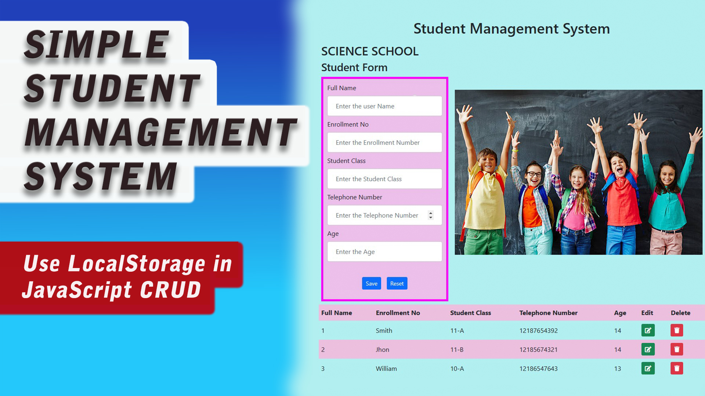

## Student Management System with local storage

This is an JavaScript code for a simple Student Management System with local storage. The system allows users to add and store student details, including full name, enrollment number, student class, telephone number, and age. The system also has functionalities to edit and delete student records.

  

 
Video Tutorial : https://youtu.be/J9H3KC-HnjA?si=VM8jr7EJ2a3Zi0pK
 
 

https://youtu.be/J9H3KC-HnjA?si=WaWa2QUJgu8iW-E2

